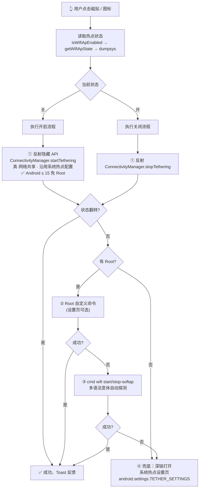

<div align="center">

# 📶 HotspotTile

### 把被平板厂商藏起来的「WiFi 热点 / WLAN 共享」开关，还给你。

**桌面一键直达热点设置页 · 控制中心磁贴真开关 · 免 Root 也能直接开热点（Android ≤ 15）**

[](https://developer.android.com)
[](https://kotlinlang.org)
[](https://github.com/RayMorTwinkle/HotspotTile/releases)
[](https://github.com/RayMorTwinkle/HotspotTile/releases)
[](https://github.com/RayMorTwinkle/HotspotTile/releases)
[](app/src/main/AndroidManifest.xml)
[](LICENSE)

*零依赖 · 无广告 · 无网络权限 · 双 Activity 单 Service 极简实现*

</div>

---

## 🤔 为什么会有这个 App

很多安卓**平板**（还有部分手机）会把「个人热点 / WLAN 共享」的开关从控制中心藏起来，
每次开热点都要：`设置 → 网络与互联网 → 热点和网络共享 → 深渊的第 N 层`……

这个 App 只做一件事：**把热点的入口和开关放回你手边**。

- 🏠 桌面点一下图标 → 直接跳到系统热点设置页
- 🔽 控制中心「WiFi热点」磁贴 → 一点就开 / 再点就关
- 🚀 在 Android ≤ 15 上（无论有没有 Root），磁贴可以直接**真·开关热点**（不是只能跳页面！）

## ✨ 功能一览

| 入口 | 默认行为 | 可自定义 |
|---|---|---|
| 🏠 桌面图标点击 | 打开系统热点设置页后自动退出 | ✅ 打开设置页 / 切换热点 / 打开本 App 设置 |
| 👆 桌面长按图标 | 弹出菜单：**热点设置**、**打开热点页** | ✅ 菜单项由系统 shortcuts 提供 |
| 🔽 控制中心磁贴点击 | 切换热点（失败自动回退打开设置页） | ✅ 切换 / 仅打开设置页 |
| 👆 控制中心磁贴长按 | 打开本 App 设置页 | ✅ 本 App 设置 / 系统热点页 / 系统默认 |

**设置页里可以调：**

- 🏷️ 热点名称 & 密码（进阶可自定义；默认自动读取系统配置，仅 Root 命令直启模式使用）
- 🎛️ 磁贴点击行为 / 磁贴长按行为 / 桌面图标点击行为
- 🧪 一键「测试开启 / 测试关闭」
- 🩺 实时诊断：系统版本、Root 可用性、热点状态、当前生效命令
- 🛠️ 高级：Root 自定义开关命令（如 `service call tethering ...`）

## 🧠 开关策略引擎

点击磁贴时，App 会沿策略链自动尝试，**谁验证成功就用谁**（cmd wifi 语法变体序号会缓存下来加速下次切换）：



## 📊 兼容性矩阵

| 设备情况 | 磁贴点击效果 | 说明 |
|---|---|---|
| Android ≤ 15 · 无 Root | ✅ **直接开关热点** | 反射 `startTethering`，真·网络共享，无需任何授权 |
| Android ≤ 15 · 有 Root | ✅ 直接开关热点 | 同上（Root 仅作为备用路径） |
| Android 16+ · 无 Root | ⚠️ 自动回退打开设置页 | 系统强制 `TETHER_PRIVILEGED`（见 [spoton 的复盘](https://www.marcogomiero.com/posts/2025/spoton-sunset/)） |
| Android 16+ · 有 Root | 🟡 视 ROM 而定 | `cmd wifi start-softap` 或设置页填入自定义命令 |
| 任意机型（怎么都失败时） | ✅ 打开系统热点页 | 万能兜底，至少少走 N 层菜单 |

> ⚠️ **关于 `cmd wifi start-softap`**：AOSP 帮助文档明确注明 *“the shell command doesn't activate internet tethering”*（不激活网络共享）。
> 但部分厂商 ROM 上实测可以正常共享网络（见下方实测记录）。装好后请用设置页的「测试开启」验证你的机型，若客户端连上但无法上网，说明该机型此路不通 —— 反射路径（≤15）不受此影响。

## 📲 安装

### 方式一：下载 APK（推荐）

到 [**Releases**](https://github.com/RayMorTwinkle/HotspotTile/releases) 下载 `app-debug.apk`，直接安装。

<details>
<summary>🛠️ 用 adb 安装</summary>

```bash
adb install -r app-debug.apk
```

</details>

### 首次使用三步走

1. **打开 App** → 自动跳到系统热点设置页，同时（Android 13+）弹出「添加到控制中心？」引导，点添加即可
2. 如果引导没弹出：下拉控制中心 → 编辑 → 把「**WiFi热点**」拖进常用区
3. （可选）桌面长按图标 → **热点设置** → 按喜好调整所有行为

## ⚙️ 设置项详解

<details>
<summary><b>🏷️ 热点名称 / 密码</b>（点开）</summary>

- 仅作用于 **Root 命令直启模式**（`cmd wifi start-softap` 需要显式传入 SSID 和密码）
- **默认（不开进阶）= 使用系统配置**：命令路径会 Root 读取 `WifiConfigStoreSoftAp.xml` 拿到系统里已配好的名称/密码，不需要重复填写；读不到时会明确报错并引导来设置页填写，**不会**伪造默认凭据
- **进阶勾选「自定义热点名称和密码」** 后，命令路径改用此处填写的凭据
- 反射路径（≤ Android 15 免 Root）永远使用系统配置，与此设置无关

</details>

<details>
<summary><b>🎛️ 三组行为开关</b>（点开）</summary>

| 配置项 | 选项 |
|---|---|
| 控制中心磁贴 · 点击 | 切换热点（推荐）/ 仅打开系统热点页 |
| 控制中心磁贴 · 长按 | 本 App 设置（推荐）/ 系统热点页 / 系统默认（应用信息） |
| 桌面图标 · 点击 | 打开系统热点页（推荐）/ 切换热点 / 打开本 App 设置 |

所有修改**即时保存**，无需点任何保存按钮。

</details>

<details>
<summary><b>🛠️ 高级 · Root 自定义命令</b>（点开）</summary>

Android 16+ 上反射被系统拦截、`cmd wifi` 又不争气时，可以填入通过 `su` 执行的自定义命令，
它会**优先于**内置 `cmd wifi` 策略执行：

```
开启：service call tethering 4 null s16 com.android.shell
关闭：service call tethering 5 i32 0
```

> 事务号（第 4 个参数）与 Android 版本/ROM 有关，请先在你的设备上用 `adb shell` 验证后再填入。

</details>

## 🔨 从源码构建

```bash
git clone https://github.com/RayMorTwinkle/HotspotTile.git
cd HotspotTile
./gradlew assembleDebug
# 产物：app/build/outputs/apk/debug/app-debug.apk
```

- 纯 Kotlin + Android Framework API，**零第三方依赖**（连 AndroidX 都没有）
- compileSdk 36 / minSdk 26（Android 8.0）/ targetSdk 34
- 用的是「无 Studio 的 cmdline 工具链」也能直接构建

## 📱 实测记录

| 设备 | 系统 | 结果 |
|---|---|---|
| TCL T508N（手机） | Android 13 | 反射直控 ✅；`cmd wifi start-softap <ssid> wpa2 <pass>` 亦可开关且可共享网络 |
| 更多平板 | —— | 🚧 待补充，欢迎提 PR / Issue 告诉我你的机型和结果 |

## ❓ FAQ

<details>
<summary><b>点了磁贴没反应 / 状态显示未知？</b></summary>

无 Root 且系统隐藏 API 读取被拦截时，App 无法得知热点状态，磁贴会显示未知并回退打开设置页。
看设置页的「诊断」一栏确认 Root 和反射支持情况。

</details>

<details>
<summary><b>为什么桌面图标点一下就"闪一下"就没了？</b></summary>

这是设计行为：无界面 Activity 完成跳转后立即退出，不在最近任务里留痕。可以在设置里把图标点击行为改成别的。

</details>

<details>
<summary><b>会联网 / 上传我的信息吗？</b></summary>

不会。App 没有 `INTERNET` 权限（可在 APK 清单里核验），热点密码只存在本机 SharedPreferences。

</details>

<details>
<summary><b>为什么要这些权限？</b></summary>

`ACCESS_WIFI_STATE` / `CHANGE_WIFI_STATE`：读取热点状态所需，均为普通权限，安装即生效，无需手动授予。

</details>

<details>
<summary><b>Root 模式首次点击会弹出 Magisk 授权？</b></summary>

是的，允许一次即可（建议在 Magisk 里设为自动允许）。拒绝过也没关系，App 会缓存结果并回退到无 Root 路径。

</details>

## 🗺️ Roadmap

- [ ] 各机型 `service call tethering` 事务号探测指南 / 数据表
- [ ] 更多 OEM 热点页面深链适配（MIUI / HyperOS / ColorOS / HarmonyOS 情况收集）
- [ ] 英文 README
- [ ] 热点配置二维码分享
- [ ] Release 签名构建

## 🙏 致谢与参考

本项目的每个策略都站在前人的肩膀上：

- [spoton: Android 16 killed the hotspot toggle trick](https://www.marcogomiero.com/posts/2025/spoton-sunset/) —— 发现反射 `ConnectivityManager.startTethering` 在 ≤15 上免 Root 可用的核心思路（[源码](https://github.com/prof18/spoton)）
- [Create custom Quick Settings tiles](https://developer.android.com/develop/ui/views/quicksettings-tiles) —— 磁贴规范、`requestAddTileService`、`QS_TILE_PREFERENCES` 长按自定义
- [Wi-Fi hotspot (Soft AP) - AOSP](https://source.android.com/docs/core/connect/wifi-softap) —— `cmd wifi start-softap` 不激活 tethering 的官方注记
- [How to turn on the wi-fi hotspot using command line with root?](https://android.stackexchange.com/questions/248841/) —— `service call tethering` 事务号思路
- [Launch a hidden Android settings activity](https://stackoverflow.com/questions/6406668/) —— `TetherSettings` 深链写法

## ⚠️ 免责声明

本项目仅供学习交流与个人设备效率工具使用。开关热点涉及系统隐藏 API 与（可选的）Root 命令，
不同 ROM 行为存在差异，请自行承担使用风险。请遵守当地法律法规，勿用于非法用途。

## 📄 License

[MIT](LICENSE) © 2026 RayMorTwinkle

---

<div align="center">

**如果这个 App 帮你省下了每次找热点开关的 30 秒，**

**请给它一个 ⭐ Star，让更多被厂商藏起开关的平板用户看到它！**

</div>
