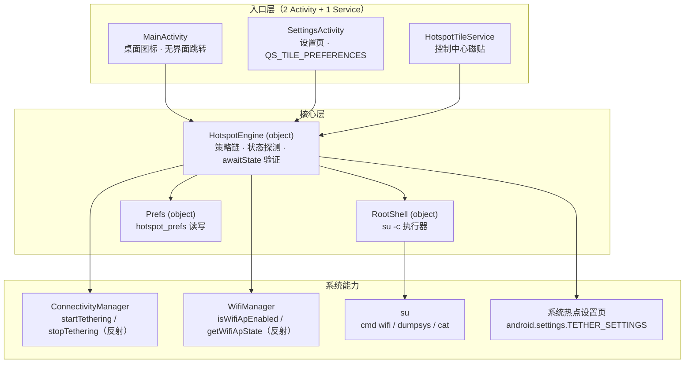
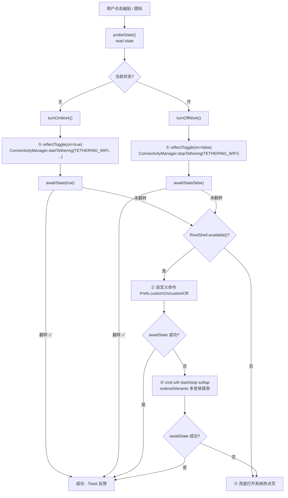
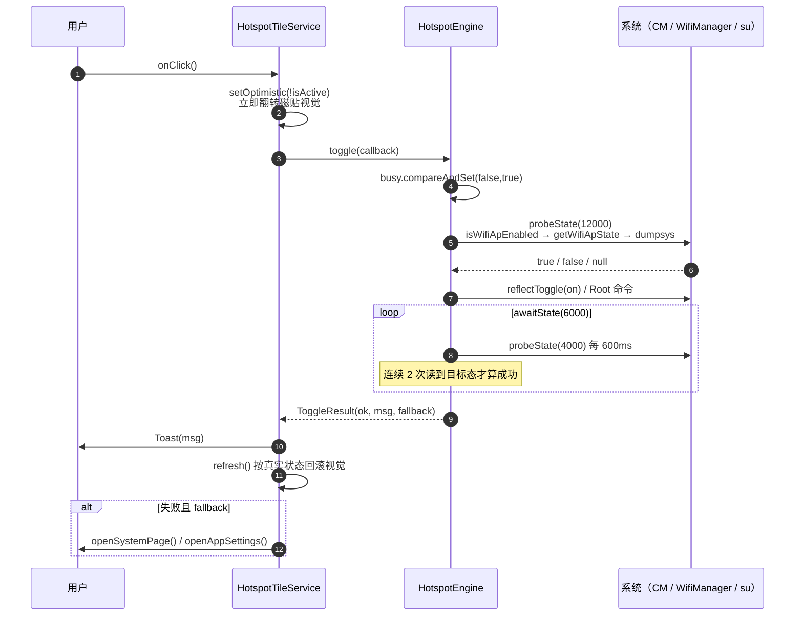
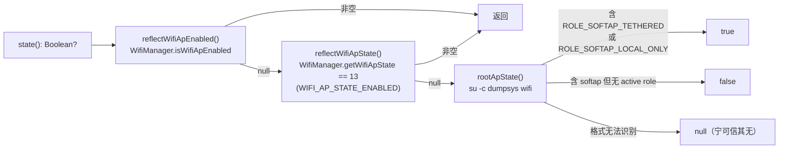
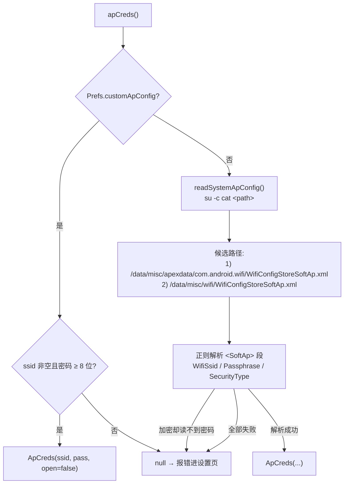

<div align="center">

> [English](./README_en.md) | **简体中文**


# HotspotTile — 把被藏起来的 WiFi 热点开关还给用户

**桌面一键直达 · 控制中心磁贴真开关 · 免 Root 直接开热点（Android ≤ 15）**

很多平板厂商把「个人热点 / WLAN 共享」从快捷面板里抹掉了。HotspotTile 把它放回你手边 ——
**不用 Root、不联网、零第三方依赖，点一下就是真开关。**


</div>

---

## 它解决什么问题

不少安卓**平板**（以及部分手机 / 定制 ROM）会把控制中心里的「个人热点 / WLAN 共享」磁贴藏起来。
于是每次开热点都要走一遍：

`设置 → 网络与互联网 → 热点和网络共享 → …一路向下第 N 层`

HotspotTile 只做一件事：**把热点的入口和开关放回你手边**。

| 入口 | 默认行为 |
|---|---|
| 🏠 桌面图标点击 | 直接跳系统热点设置页，跳完自动退出（不占最近任务） |
| 👆 桌面长按图标 | 弹出菜单：**热点设置** / **打开热点页** |
| 🔽 控制中心磁贴点击 | **真·开关热点**（失败自动回退打开设置页） |
| 👆 控制中心磁贴长按 | 打开 HotspotTile 设置页 |

> **它与你设备的关系**：只调用系统开放的 / 反射的框架 API 与可选的本机 `su` 命令。
> **没有 `INTERNET` 权限**（可在 APK 清单核验），热点密码只存在本机 `SharedPreferences`，
> 全程无网络、无广告、无统计。

---

## ✨ 功能

- 📶 **免 Root 真开关**：Android ≤ 15 上通过反射 `ConnectivityManager.startTethering` / `stopTethering`
  直接开启系统网络共享，沿用系统已配好的热点名称/密码 —— 不是只跳页面。
- 🎛️ **控制中心磁贴**：`TileService` 实装，点击切换、长按进设置页；打开面板即刷新真实状态
  （Android 10+ / API 29+ 显示「热点已开 / 热点已关」副标题）。
- 🏠 **桌面快捷方式**：启动器图标一键直达系统热点页；长按图标弹出 `shortcuts.xml` 菜单。
- 🧠 **策略链自动降级**：反射 → Root 自定义命令 → `cmd wifi start/stop-softap`（多变体自动探测）
  → 兜底打开系统设置页，谁验证成功就用谁。
- ✅ **以真实状态为准**：每次开关都轮询验证状态是否**真的翻转**（连续两次读到目标态），
  从不信任调用本身的返回值。
- 🔐 **凭据不伪造**：默认自动读取系统热点配置；读不到时明确报错并引导你填写，**绝不**编造默认 SSID/密码。
- 🪶 **极简实现**：Kotlin + Android Framework，**零第三方依赖**（连 AndroidX 都没有），APK ≈ 0.9 MB。
- 🔒 **隐私**：无 `INTERNET` 权限、`allowBackup=false`、无任何后台常驻。

---

## 🚀 快速开始

### 方式一：面向 AI Agent（一键安装，推荐）

把下面这段提示词直接发给你的本地 AI Agent（Claude Code / Codex / OpenCode …），它会自动完成克隆、构建与安装：

````markdown
请帮我安装并部署 HotspotTile（GitHub: https://github.com/RayMorTwinkle/HotspotTile）。
背景：HotspotTile 是一个 Android 应用，把被平板厂商隐藏的「WiFi 热点 / WLAN 共享」
开关还给用户：桌面一键直达热点设置页 + 控制中心磁贴真开关（Android ≤15 免 Root）。

环境要求：JDK 17、Android SDK（platform-tools 里有 adb）、一台已连接并开启 USB 调试的 Android 设备。

步骤：
1. 克隆：git clone https://github.com/RayMorTwinkle/HotspotTile.git && cd HotspotTile
2. 构建 debug 包：./gradlew assembleDebug
   （产物：app/build/outputs/apk/debug/app-debug.apk；若缺 SDK 先设置 ANDROID_HOME）
3. 安装到设备：adb install -r app/build/outputs/apk/debug/app-debug.apk
4. 验证：adb shell pm list packages | grep com.ray.hotspot   # 应输出 package:com.ray.hotspot
5. 告诉用户：首次打开 App 会自动跳转系统热点设置页，并在 Android 13+ 弹出
   「添加到控制中心」引导；若没弹出，下拉控制中心 → 编辑 → 把「WiFi热点」拖进常用区。
6. 提醒用户：若想直接开关（而非只跳页），在设置页用「测试开启 / 测试关闭」验证本机是否支持。
````

### 方式二：面向人类用户

```bash
git clone https://github.com/RayMorTwinkle/HotspotTile.git
cd HotspotTile
./gradlew assembleDebug        # 产物：app/build/outputs/apk/debug/app-debug.apk
adb install -r app/build/outputs/apk/debug/app-debug.apk
```

或直接到 [**Releases**](https://github.com/RayMorTwinkle/HotspotTile/releases) 下载正式签名的
`HotspotTile-x.y.z.apk` 安装。

<details>
<summary>校验 APK 真伪（可选）</summary>

v1.0.4 起所有 release 产物由同一把 release key 签名，证书 SHA-256 指纹：

```text
c79d553ca63b7f60964cd3f997b10f4aa7a594e4041932475fa47fb9596fe3d4
```

```bash
# 比对 SHA-256 digest
apksigner verify --print-certs HotspotTile-*.apk
```

签名不匹配的安装包会被 Android 直接拒绝覆盖安装。
</details>

> **环境要求**：JDK 17、Android SDK（`ANDROID_HOME` 指向命令行工具）、Gradle Wrapper 会自动拉取
> Gradle 9.5.1。构建仅支持 POSIX（仓库未附 `gradlew.bat`）。
> **首次使用三步走**：① 打开 App（自动跳热点设置页 + Android 13+ 弹加磁贴引导）
> ② 没弹就手动把「WiFi热点」拖进控制中心 ③ 长按图标 →「热点设置」按需调整行为。

---

## 🖥️ 使用

### 三个入口，全部可自定义

| 入口 | 可配置行为（设置页单选） |
|---|---|
| 桌面图标 · 点击（`launcher_click`） | 打开系统热点页 / 切换热点 / 打开本 App 设置 |
| 控制中心磁贴 · 点击（`tile_click`） | 切换热点 / 仅打开系统热点页 |
| 控制中心磁贴 · 长按（`tile_longpress`） | 本 App 设置 / 系统热点页 / 系统默认（应用信息） |

所有修改**即时保存**，无需点保存按钮。

### 设置页还能做什么

- 🏷️ **热点名称 / 密码（进阶）**：默认关闭，勾选后自定义；仅作用于 `cmd wifi` 直启路径
- 🧪 **测试开启 / 测试关闭**：手动验证本机能否直接开关
- 🩺 **实时诊断**：系统版本、Root 可用性、热点真实状态、反射支持判断、脱敏后的生效命令
- 🛠️ **高级 · Root 自定义命令**：为 Android 16+ 等特殊 ROM 填入自定义开关命令
- 🔄 **重新检测 Root**：Magisk 首次授权弹窗导致超时时，可手动重测

### 兼容性矩阵

| 设备情况 | 磁贴点击效果 | 走哪条路径 |
|---|---|---|
| Android ≤ 15 · 无 Root | ✅ **直接开关热点** | 反射 `startTethering` / `stopTethering` |
| Android ≤ 15 · 有 Root | ✅ 直接开关热点 | 反射优先，Root 命令作为备用 |
| Android 16+ · 无 Root | ⚠️ 自动回退打开设置页 | 反射被 `TETHER_PRIVILEGED` 拦截（[spoton 复盘](https://www.marcogomiero.com/posts/2025/spoton-sunset/)） |
| Android 16+ · 有 Root | 🟡 视 ROM 而定 | `cmd wifi start-softap` 或自定义命令 |
| 任意机型（全都失败时） | ✅ 打开系统热点页 | 万能兜底，至少少走 N 层菜单 |

### 实测记录

| 设备 | 系统 | 结果 |
|---|---|---|
| TCL T508N（手机） | Android 13 / Magisk 27.0 | root 读系统 XML + `cmd wifi start-softap '<ssid>' wpa2 '<pass>'`（变体 0）实测可开关且能共享网络（反射路径待补验证） |
| 更多机型 | —— | 🚧 待补充，欢迎提 Issue 告诉我你的结果 |

---

## 🏗️ 架构

### 系统总览

双 Activity + 单 Service 的极简结构，全部开关逻辑收敛在 `HotspotEngine` 单例中。


```mermaid
flowchart TB
  subgraph UI["入口层（2 Activity + 1 Service）"]
    direction LR
    MA["MainActivity<br/>桌面图标 · 无界面跳转"]
    SA["SettingsActivity<br/>设置页 · QS_TILE_PREFERENCES"]
    TS["HotspotTileService<br/>控制中心磁贴"]
  end

  subgraph CORE["核心层"]
    ENG["HotspotEngine (object)<br/>策略链 · 状态探测 · awaitState 验证"]
    RS["RootShell (object)<br/>su -c 执行器"]
    PF["Prefs (object)<br/>hotspot_prefs 读写"]
  end

  subgraph SYS["系统能力"]
    CM["ConnectivityManager<br/>startTethering / stopTethering（反射）"]
    WM["WifiManager<br/>isWifiApEnabled / getWifiApState（反射）"]
    SU["su<br/>cmd wifi / dumpsys / cat"]
    SE["系统热点设置页<br/>android.settings.TETHER_SETTINGS"]
  end

  MA --> ENG
  SA --> ENG
  TS --> ENG
  ENG --> PF
  ENG --> RS
  ENG --> CM
  ENG --> WM
  RS --> SU
  ENG --> SE
```

### 开关策略链（点击磁贴 / 图标后发生什么）

策略从上到下依次尝试，**每一环都以 `awaitState()` 验证状态真的翻转才算成功**：


```mermaid
flowchart TD
  A["用户点击磁贴 / 图标"] --> B["probeState()<br/>read state"]
  B --> C{"当前状态?"}
  C -->|关| D["turnOnWork()"]
  C -->|开| E["turnOffWork()"]

  D --> F["① reflectToggle(on=true)<br/>ConnectivityManager.startTethering(TETHERING_WIFI, ...)"]
  E --> G["① reflectToggle(on=false)<br/>ConnectivityManager.stopTethering(TETHERING_WIFI)"]
  F --> H["awaitState(true)"]
  G --> I["awaitState(false)"]

  H -->|翻转 ✅| OK["成功 · Toast 反馈"]
  I -->|翻转 ✅| OK
  H -->|未翻转| J{"RootShell.available()?"}
  I -->|未翻转| J

  J -->|否| FB["④ 兜底打开系统热点页"]
  J -->|是| K["② 自定义命令 Prefs.customOn/customOff"]
  K --> L{"awaitState 成功?"}
  L -->|是| OK
  L -->|否| M["③ cmd wifi start/stop-softap<br/>orderedVariants 多变体探测"]
  M --> N{"awaitState 成功?"}
  N -->|是| OK
  N -->|否| FB
```

### 磁贴点击时序


```mermaid
sequenceDiagram
  autonumber
  participant U as 用户
  participant T as HotspotTileService
  participant E as HotspotEngine
  participant S as 系统（CM / WifiManager / su）

  U->>T: onClick()
  T->>T: setOptimistic(!isActive)<br/>立即翻转磁贴视觉
  T->>E: toggle(callback)
  E->>E: busy.compareAndSet(false,true)
  E->>S: probeState(12000)<br/>isWifiApEnabled → getWifiApState → dumpsys
  S-->>E: true / false / null
  E->>S: reflectToggle(on) / Root 命令
  loop awaitState(6000)
    E->>S: probeState(4000) 每 600ms
    Note over E: 连续 2 次读到目标态才算成功
  end
  E-->>T: ToggleResult(ok, msg, fallback)
  T->>U: Toast(msg)
  T->>T: refresh() 按真实状态回滚视觉
  alt 失败且 fallback
    T->>U: openSystemPage() / openAppSettings()
  end
```

### 状态读取的三级降级

`state()` 返回 `Boolean?`（`null` = 无从得知），三路依次尝试，诚实兜底：


```mermaid
flowchart LR
  A["state(): Boolean?"] --> B["reflectWifiApEnabled()<br/>WifiManager.isWifiApEnabled"]
  B -->|非空| R["返回"]
  B -->|null| C["reflectWifiApState()<br/>WifiManager.getWifiApState == 13<br/>(WIFI_AP_STATE_ENABLED)"]
  C -->|非空| R
  C -->|null| D["rootApState()<br/>su -c dumpsys wifi"]
  D -->|含 ROLE_SOFTAP_TETHERED<br/>或 ROLE_SOFTAP_LOCAL_ONLY| T["true"]
  D -->|含 softap 但无 active role| F["false"]
  D -->|格式无法识别| N["null（宁可信其无）"]
```

### 凭据解析：绝不伪造


```mermaid
flowchart TD
  A["apCreds()"] --> B{"Prefs.customApConfig?"}
  B -->|是| C{"ssid 非空且密码 ≥ 8 位?"}
  C -->|是| D["ApCreds(ssid, pass, open=false)"]
  C -->|否| N1["null → 报错进设置页"]
  B -->|否| E["readSystemApConfig()<br/>su -c cat &lt;path&gt;"]
  E --> F["候选路径:<br/>1) /data/misc/apexdata/com.android.wifi/WifiConfigStoreSoftAp.xml<br/>2) /data/misc/wifi/WifiConfigStoreSoftAp.xml"]
  F --> G["正则解析 &lt;SoftAp&gt; 段<br/>WifiSsid / Passphrase / SecurityType"]
  G -->|解析成功| D2["ApCreds(...)"]
  G -->|加密却读不到密码| N1
  G -->|全部失败| N1
```

---

## 📂 目录结构

```text
HotspotTile/
├── app/
│   ├── build.gradle.kts                 # compileSdk 36 / minSdk 26 / targetSdk 34（锁定）
│   └── src/main/
│       ├── AndroidManifest.xml          # 权限 + 2 Activity + 1 Service
│       ├── java/com/ray/hotspot/
│       │   ├── HotspotEngine.kt         # ★ 策略链 / 状态探测 / 凭据解析 / 诊断
│       │   ├── HotspotTileService.kt    # 控制中心磁贴（TileService）
│       │   ├── MainActivity.kt          # 桌面入口（无界面跳转）
│       │   ├── SettingsActivity.kt      # 设置页 + 磁贴长按入口
│       │   ├── RootShell.kt             # su -c 执行器（探测缓存 / 超时清理）
│       │   └── Prefs.kt                 # SharedPreferences 集中读写
│       └── res/
│           ├── xml/shortcuts.xml        # 桌面长按菜单两项
│           ├── layout/activity_settings.xml
│           └── values/strings.xml       # 文案：「WiFi热点」「热点设置」「打开热点页」
├── docs/
│   ├── spec/spec1-review-fixes.md       # 审查修复规格 + 真机验证记录
│   └── verification-checklist.md        # 发版前真机清单
├── fastlane/metadata/android/           # F-Droid / 应用商店文案（zh-CN / en-US）
├── .github/workflows/ci.yml             # 提交门禁：编译 + lint
├── .github/workflows/release.yml        # 手动触发 → 签名 APK → tag → Release
├── gradle/libs.versions.toml            # 仅 agp = 9.2.0
├── AGENTS.md                            # 供 AI Agent 阅读的项目导览
└── LICENSE                              # MIT
```

---

## 🔧 技术细节

### 构建坐标

| 项 | 值 |
|---|---|
| `applicationId` / `namespace` | `com.ray.hotspot` |
| `compileSdk` / `minSdk` / `targetSdk` | 36 / 26（Android 8.0）/ **34（刻意锁定）** |
| AGP / Gradle / JDK | 9.2.0 / 9.5.1 / 17 |
| 第三方依赖 | **无**（无 AndroidX、无 Compose） |
| 当前版本 | 1.0.5（`versionCode` 10005） |

### 为什么 `targetSdk` 锁在 34

这是**承重墙**，不是懒得升：

1. **hidden-API 灰名单按 targetSdk 分级**：升高到 35/36 会失去 `WifiManager.getWifiApState`、
   `isWifiApEnabled` 等反射可用性，免 Root 路径直接失效。
2. **避开 Android 15 强制 edge-to-edge** 对 `Theme.DeviceDefault.Settings` 布局的破坏。

### 反射调用：真开关的核心

`reflectToggle(on)` 反射 `ConnectivityManager` 的隐藏方法，按**参数签名**精确匹配（不硬编码方法名以外的假设）：

- **开**：`startTethering(int, boolean, OnStartTetheringCallback, [Handler])` —— 实参 `TETHERING_WIFI = 0`；
- **关**：`stopTethering(int)` —— 实参 `TETHERING_WIFI`。

`callback` 传 `null` 会触发其内部 NPE，但该 NPE 只发生在**本 App 进程**的专用线程（附带兜底
`UncaughtExceptionHandler` 吞掉），`system_server` 不受影响，真正的 tethering 指令在 NPE 之前已通过
binder 发出。

### `awaitState()`：以真实状态为准

任何开关动作都**不信任调用本身成功**：`awaitState(target)` 每 **600 ms** 探测一次，需**连续两次**
读到目标状态（约 1.2 s）才算稳定成功，避免系统短暂上报目标态后又回滚被误判。单次探测超时 4 s，
整轮上限 6 s。状态完全读不到时**按失败处理**（宁可信其无）。

### `RootShell`：最小化 su 执行器

- 可用性探测 `su -c id`，输出含 `uid=0` 才算 Root 可用；**仅缓存确定性结果** —— 超时（`exitCode == -1`）
  不写缓存，避免 Magisk 授权弹窗期间把用户误判成无 Root（`forgetCache()` 供「重新检测 Root」调用）。
- `exec()` 把输出**重定向到临时文件**（`sh_<nanoTime>.txt`）而非管道，避免大输出撑满管道死锁；
  `stdin` 指到 `/dev/null`，防止 `read` 型命令卡到超时；进程启动时清理上次残留的 `sh_*`。
- ⚠️ 已知限制：Android 没有进程组 kill —— 超时后 `destroyForcibly()` 只杀 `su` 壳进程，
  `-c` 的子命令可能仍以 root 跑完，调用方**不可假定「超时 = 没执行」**。

### `cmd wifi` 变体表（为不同 ROM 探测）

启动变体在所有凭据路径下的候选（`startCmd`），成功后写入 `Prefs.startVariant` 加速下次：

| 变体 | 命令 | 备注 |
|---|---|---|
| 0 | `cmd wifi start-softap '<ssid>' wpa2 '<pass>'` | T508N 实测语法 |
| 1 | `cmd wifi start-softap '<ssid>' wpa3 '<pass>'` | —— |
| 2 | `cmd wifi start-softap ap0 wpa2 '<ssid>' '<pass>'` | AOSP ifname 风格 |
| 3 | `cmd wifi start-softap ap0 wpa2-psk '<ssid>' '<pass>'` | —— |
| 4 | `cmd wifi start-softap '<ssid>' open` | **仅**当系统配置本身就是开放热点时可达 |

关闭变体（`stopCmd`）：`0` = `cmd wifi stop-softap`、`1` = `... ap0`、`2` = `... '<ssid>'`。
所有凭据经 `shq()` 单引号转义（内部 `'` → `'\''`），防 `$` `` ` `` `"` `\` 破坏命令语法。
连续 3 轮（`VARIANT_FAIL_RESET = 3`）变体全失败会重置缓存序号。

> AOSP 文档明确注明 `cmd wifi start-softap` **不激活 internet tethering**，能否上网取决于 ROM。
> 反射路径（≤ Android 15）不受此影响。

### 存储键一览（`hotspot_prefs`，`MODE_PRIVATE`）

| 键 | 类型 | 默认 | 含义 |
|---|---|---|---|
| `launcher_click` | String | `page` | 桌面图标点击：page / toggle / settings |
| `tile_click` | String | `toggle` | 磁贴点击：toggle / page |
| `tile_longpress` | String | `settings` | 磁贴长按：settings / page / system |
| `custom_ap_config` | Boolean | `false` | 进阶：自定义热点名称/密码 |
| `ap_ssid` / `ap_pass` | String | `""` | 自定义凭据（仅进阶生效） |
| `custom_on` / `custom_off` | String | `""` | Root 自定义开关命令 |
| `tile_prompted` | Boolean | `false` | 首次加磁贴引导只弹一次 |
| `start_variant` / `stop_variant` | Int | `-1` | 生效的 cmd wifi 变体缓存 |
| `start_variant_fails` / `stop_variant_fails` | Int | `0` | 变体整轮失败计数 |

> `ap_pass` 明文存储是**有意取舍**：`MODE_PRIVATE` + `allowBackup=false` + 零依赖（不引入
> `EncryptedSharedPreferences`），且凭据进 shell 前经 `shq()` 转义；诊断页只显示位数/掩码。

### 系统热点页深链候选（`settingsCandidates`，依次尝试）

```text
android.settings.TETHER_SETTINGS
com.android.settings / com.android.settings.TetherSettings
com.android.settings / com.android.settings.Settings$TetherSettingsActivity
android.settings.WIRELESS_SETTINGS
android.settings.SETTINGS
```

### 安全细节

- `MainActivity` 的 `mode` extra **仅**在 `action == "com.ray.hotspot.action.OPEN_PAGE"`（内部
  shortcut 专用）时读取，防止任意 App 借 exported Activity 驱动反射 / Root 路径。
- 磁贴服务带 `BIND_QUICK_SETTINGS_TILE` 权限 + `TOGGLEABLE_TILE=true`；`MainActivity`
  `excludeFromRecents` + 透明主题。
- 诊断中的输出命令会先掩码密码再展示，诊断文本不含明文。

### 发版流程

- **CI**（`ci.yml`）：push/PR → `assembleDebug` + lint 报告（lint 不阻断，`abortOnError=false`）。
- **Release**（`release.yml`，手动触发）：版本号可留空自动 patch+1 → 从 GitHub Secrets 还原 keystore
  → `assembleRelease` 签名 → 产物改名 `HotspotTile-<version>.apk` + `.sha256` → 打 tag 建 Release。
- 发版前**先 bump** `app/build.gradle.kts` 的 `versionName`/`versionCode` 默认值（F-Droid 源码构建依赖入库值）。

---

## ❓ 常见问题

**Q：点了磁贴没反应 / 状态显示未知？**
A：无 Root 且系统隐藏 API 读取被拦截时，App 无法得知热点状态，磁贴会显示未知并回退打开设置页。
到设置页「诊断」栏确认 Root 与反射支持情况。

**Q：为什么桌面图标点一下就"闪一下"消失了？**
A：这是设计行为：无界面 Activity 完成跳转后立即 `finish()`，不在最近任务里留痕。可在设置里改成别的行为。

**Q：会联网 / 上传我的信息吗？**
A：不会。App 没有 `INTERNET` 权限（可在 APK 清单核验），热点密码只存在本机 `SharedPreferences`。

**Q：为什么要 `ACCESS_WIFI_STATE` / `CHANGE_WIFI_STATE`？**
A：读取热点状态所需，**均为普通权限**，安装即生效，无需手动授予。

**Q：Root 模式首次点击会弹 Magisk 授权？**
A：是的，允许一次即可（可在 Magisk 里设为自动允许）。拒绝也没关系，App 会缓存结果并回退无 Root 路径；
若因弹窗超时被误判，设置页「重新检测 Root」可恢复。

**Q：Android 16 上还能直接开吗？**
A：无 Root 大概率不行 —— 系统收紧了 `TETHER_PRIVILEGED`。App 会自动回退打开设置页；
有 Root 可尝试 `cmd wifi` 或自定义命令。

---

## ⚠️ 注意事项

- 开关热点涉及**系统隐藏 API** 与可选的 Root 命令，不同 ROM 行为差异较大，请自行承担使用风险。
- Android 16+ 反射被拦截是**系统策略**，非 Bug；`cmd wifi start-softap` 是否真能上网取决于机型 ROM。
- **已知限制（有意取舍）**：MainActivity 的 toggle 模式进程可能在切换中途被系统杀死；
  `su` 超时只杀壳进程；API 26–28 磁贴无 subtitle。
- 本项目**无仪器化测试**（UI 与系统服务强耦合），验证方式为编译通过 + 按
  `docs/verification-checklist.md` 手工过真机清单。
- 仅供个人设备效率工具与学习交流使用，请遵守当地法律法规，勿用于非法用途。

---

## 📄 License

[MIT](LICENSE) © 2026 RayMorTwinkle

---

## 🙏 致谢 / Credits

本项目的每条策略都站在前人的肩膀上：

- [**spoton** — Android 16 killed the hotspot toggle trick](https://www.marcogomiero.com/posts/2025/spoton-sunset/)
  —— 发现反射 `ConnectivityManager.startTethering` 在 ≤15 上免 Root 可用的核心思路（[源码](https://github.com/prof18/spoton)）。
- [**Create custom Quick Settings tiles**](https://developer.android.com/develop/ui/views/quicksettings-tiles)
  —— `TileService` 规范、`requestAddTileService`、`QS_TILE_PREFERENCES` 长按自定义。
- [**Wi-Fi hotspot (Soft AP)** — AOSP](https://source.android.com/docs/core/connect/wifi-softap)
  —— `cmd wifi start-softap` 不激活 tethering 的官方注记。
- [**How to turn on the wi-fi hotspot using command line with root?**](https://android.stackexchange.com/questions/248841/)
  —— `service call tethering` 事务号思路。
- [**Launch a hidden Android settings activity**](https://stackoverflow.com/questions/6406668/)
  —— `TetherSettings` 深链写法。

本仓库的图标、中英双语 README 与架构图为本项目重制。

---

<div align="center">

**如果这个 App 帮你省下了每次找热点开关的 30 秒，**

**请给它一个 ⭐ Star，让更多被厂商藏起开关的平板用户看到它。**

<sub>HotspotTile · 把开关，还给用户</sub>

</div>
