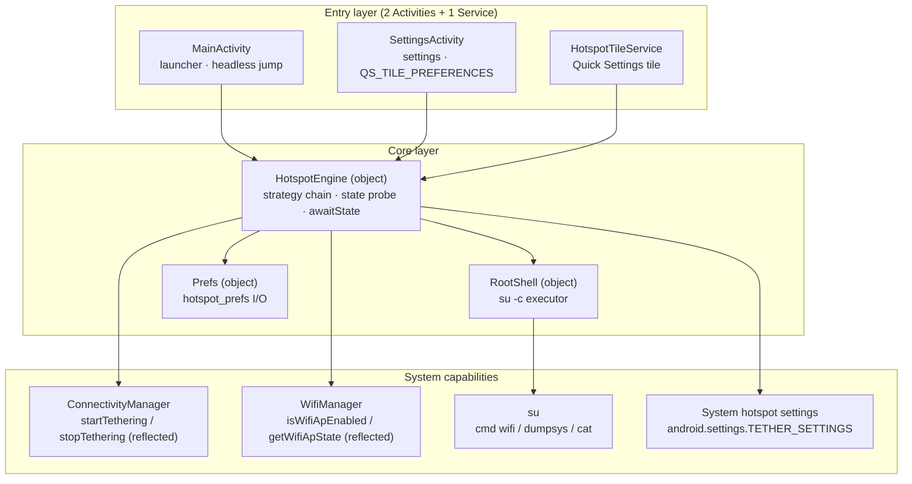
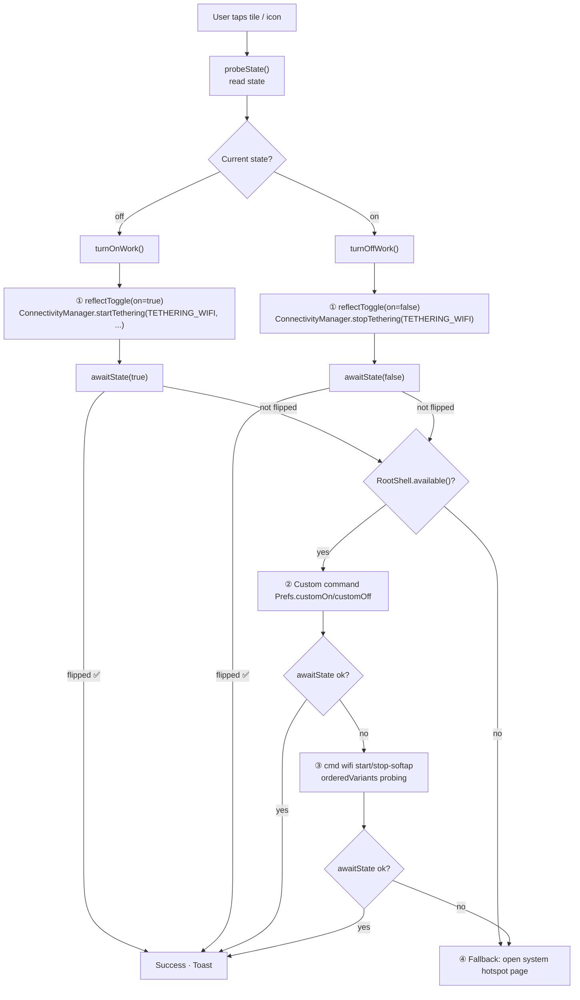
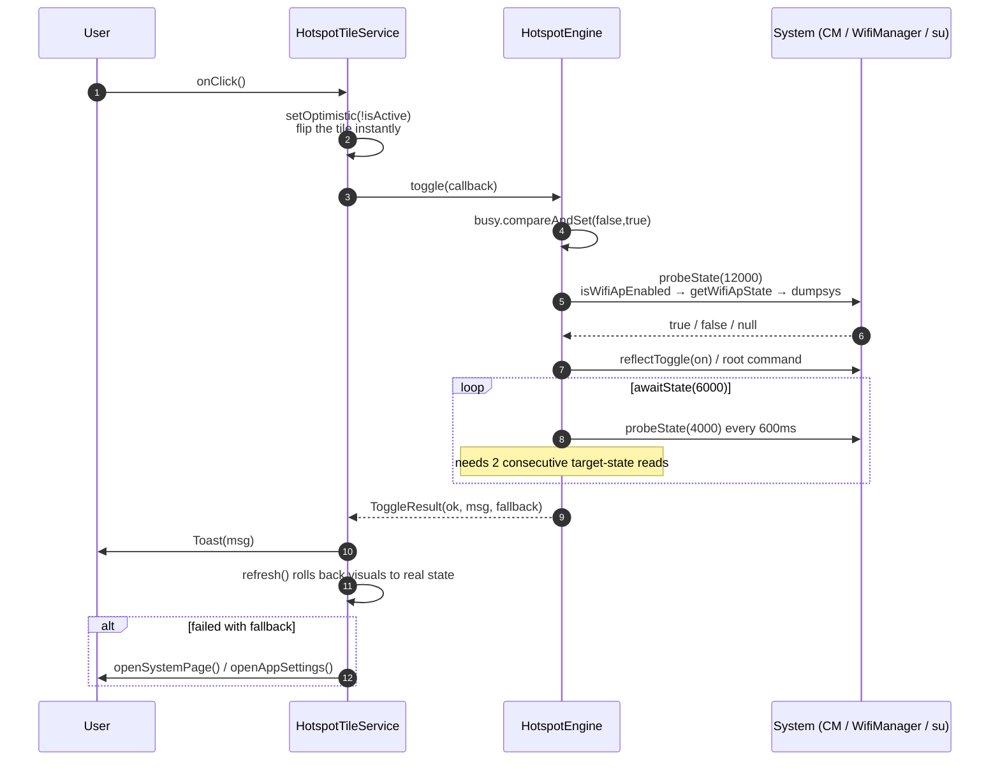
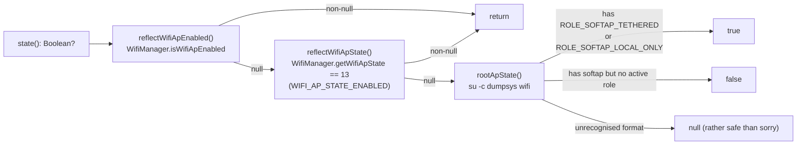
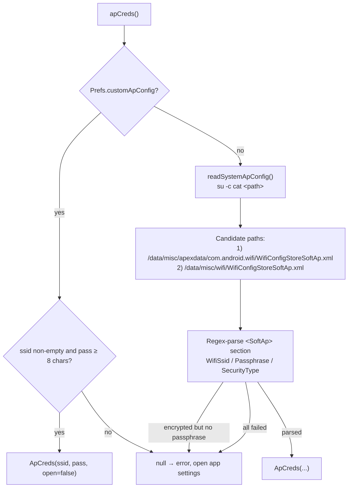

<div align="center">

> **English** | [简体中文](./README.md)


# HotspotTile — Give the hotspot switch back to the user

**One-tap from the home screen · a real Quick Settings tile · toggle the hotspot without root (Android ≤ 15)**

Many tablet vendors erased the "Personal Hotspot / WLAN sharing" toggle from the quick panel.
HotspotTile puts it back at your fingertips — **no root, no network permission, zero third-party
dependencies, and a single tap is a real toggle.**


</div>

---

## Why it exists

Many Android **tablets** (and some phones / custom ROMs) hide the "Personal Hotspot / WLAN sharing"
tile from the Quick Settings panel. Every time you want to share your connection, you have to walk
through:

`Settings → Network & Internet → Hotspot & tethering → … N levels down`

HotspotTile does exactly one thing: **it puts the hotspot entry and switch back within reach.**

| Entry point | Default behaviour |
|---|---|
| 🏠 Tap the launcher icon | Jump straight to system hotspot settings, then exit (no recents trace) |
| 👆 Long-press the launcher icon | Menu: **Hotspot settings** / **Open hotspot page** |
| 🔽 Tap the Quick Settings tile | **Really toggle the hotspot** (falls back to opening Settings on failure) |
| 👆 Long-press the Quick Settings tile | Open the HotspotTile settings page |

> **What it does with your device**: it only calls framework APIs (open or reflected) and the
> optional local `su` command. It has **no `INTERNET` permission** (verifiable in the APK manifest),
> stores the hotspot password only in local `SharedPreferences`, and never goes online — no ads,
> no telemetry.

---

## ✨ Features

- 📶 **Real toggle, no root**: on Android ≤ 15 it reflects `ConnectivityManager.startTethering` /
  `stopTethering` to enable genuine system tethering, reusing the system-configured SSID/password —
  not a mere shortcut to a settings page.
- 🎛️ **Quick Settings tile**: a real `TileService`; tap toggles, long-press opens the settings page,
  and the state refreshes the moment the panel opens (Android 10+ / API 29+ shows a "Hotspot on / off" subtitle).
- 🏠 **Launcher shortcut**: one tap opens system hotspot settings; long-press shows an
  `shortcuts.xml` menu.
- 🧠 **Automatic strategy fallback**: reflection → root custom command → `cmd wifi start/stop-softap`
  (multi-variant probing) → open the system settings page. Whatever verifies success wins.
- ✅ **Truth over invocation**: every toggle polls until the state **actually flips** (two consecutive
  reads of the target state); the call's return value is never trusted.
- 🔐 **Credentials are never faked**: it reads the system hotspot config by default and, if it can't,
  reports the error and asks you to fill it in — it **never** invents a default SSID/password.
- 🪶 **Minimal**: Kotlin + Android Framework, **zero third-party dependencies** (not even AndroidX),
  APK ≈ 0.9 MB.
- 🔒 **Privacy**: no `INTERNET` permission, `allowBackup=false`, no resident background service.

---

## 🚀 Quick Start

### Option 1 — For AI agents (one-shot install, recommended)

Paste the prompt below to your local AI agent (Claude Code / Codex / OpenCode …) and it will clone,
build and install everything:

````markdown
Please install and deploy HotspotTile (GitHub: https://github.com/RayMorTwinkle/HotspotTile).
Context: HotspotTile is an Android app that gives users back the "Wi-Fi hotspot / WLAN sharing"
switch hidden by tablet vendors: one-tap home-screen access to hotspot settings + a real Quick
Settings tile (real toggle without root on Android ≤15).

Requirements: JDK 17, Android SDK (adb from platform-tools), and an Android device connected with USB debugging enabled.

Steps:
1. Clone: git clone https://github.com/RayMorTwinkle/HotspotTile.git && cd HotspotTile
2. Build debug: ./gradlew assembleDebug
   (artifact: app/build/outputs/apk/debug/app-debug.apk; set ANDROID_HOME if the SDK isn't found)
3. Install: adb install -r app/build/outputs/apk/debug/app-debug.apk
4. Verify: adb shell pm list packages | grep com.ray.hotspot   # should print package:com.ray.hotspot
5. Tell the user: on first launch the app jumps to system hotspot settings and, on Android 13+,
   shows the "Add to Quick Settings" prompt; if it doesn't, pull down Quick Settings → Edit → drag
   "WiFi热点" into the active tiles.
6. Remind the user: to actually toggle (rather than only open a page), use the in-app "Test ON /
   Test OFF" buttons to verify their device supports it.
````

### Option 2 — For humans

```bash
git clone https://github.com/RayMorTwinkle/HotspotTile.git
cd HotspotTile
./gradlew assembleDebug        # artifact: app/build/outputs/apk/debug/app-debug.apk
adb install -r app/build/outputs/apk/debug/app-debug.apk
```

Or download the release-signed `HotspotTile-x.y.z.apk` from
[**Releases**](https://github.com/RayMorTwinkle/HotspotTile/releases).

<details>
<summary>Verify the APK (optional)</summary>

Since v1.0.4 every release artifact is signed with the same release key; certificate SHA-256 fingerprint:

```text
c79d553ca63b7f60964cd3f997b10f4aa7a594e4041932475fa47fb9596fe3d4
```

```bash
# compare the SHA-256 digest
apksigner verify --print-certs HotspotTile-*.apk
```

An APK whose signature doesn't match will be rejected by Android on install.
</details>

> **Requirements**: JDK 17, Android SDK (`ANDROID_HOME` pointing at the command-line tools);
> the Gradle Wrapper pulls Gradle 9.5.1 automatically. Builds are POSIX-only (no `gradlew.bat` in the repo).
> **First run in three steps**: ① open the app (jumps to hotspot settings + Android 13+ tile prompt)
> ② if it didn't appear, drag "WiFi热点" into Quick Settings manually ③ long-press the launcher icon →
> "Hotspot settings" to tune behaviour.

---

## 🖥️ Usage

### Three entry points, all configurable

| Entry point | Configurable behaviour (settings page radio) |
|---|---|
| Launcher icon · tap (`launcher_click`) | Open system hotspot page / toggle / open app settings |
| QS tile · tap (`tile_click`) | Toggle / open system hotspot page |
| QS tile · long-press (`tile_longpress`) | App settings / system hotspot page / system default (app info) |

All changes **save instantly** — no save button.

### What else the settings page does

- 🏷️ **Hotspot name / password (advanced)**: off by default; when enabled, the `cmd wifi` path uses
  your custom credentials
- 🧪 **Test ON / Test OFF**: manually verify whether your device can toggle directly
- 🩺 **Live diagnostics**: OS version, root availability, real hotspot state, reflection-support
  judgement, and the masked effective command
- 🛠️ **Advanced · root custom command**: for special ROMs such as Android 16+
- 🔄 **Re-check root**: retest manually when the first Magisk prompt times out

### Compatibility matrix

| Device | Tile behaviour | Path taken |
|---|---|---|
| Android ≤ 15 · no root | ✅ **Real toggle** | Reflected `startTethering` / `stopTethering` |
| Android ≤ 15 · root | ✅ Real toggle | Reflection first, root commands as fallback |
| Android 16+ · no root | ⚠️ Falls back to opening Settings | Reflection blocked by `TETHER_PRIVILEGED` ([spoton post-mortem](https://www.marcogomiero.com/posts/2025/spoton-sunset/)) |
| Android 16+ · root | 🟡 ROM-dependent | `cmd wifi start-softap` or a custom command |
| Anything (all paths fail) | ✅ Opens system hotspot page | Universal fallback — saves N menu levels |

### Verified on real hardware

| Device | OS | Result |
|---|---|---|
| TCL T508N (phone) | Android 13 / Magisk 27.0 | root reads the system XML + `cmd wifi start-softap '<ssid>' wpa2 '<pass>'` (variant 0) toggles and shares the network (reflection path pending verification) |
| More devices | —— | 🚧 To be filled in — open an Issue with your result |

---

## 🏗️ Architecture

### System overview

Two Activities + a single Service; all toggle logic funnels through the `HotspotEngine` singleton.



### Toggle strategy chain (what happens after a tap)

Tried top to bottom; **every step only counts as success if `awaitState()` confirms a real flip**:



### Tile tap sequence



### Three-tier state probe

`state()` returns `Boolean?` (`null` = unknown), tried in order with an honest fallback:



### Credential resolution: never fake



---

## 📂 Project layout

```text
HotspotTile/
├── app/
│   ├── build.gradle.kts                 # compileSdk 36 / minSdk 26 / targetSdk 34 (locked)
│   └── src/main/
│       ├── AndroidManifest.xml          # permissions + 2 Activities + 1 Service
│       ├── java/com/ray/hotspot/
│       │   ├── HotspotEngine.kt         # ★ strategy chain / state probe / credentials / diagnostics
│       │   ├── HotspotTileService.kt    # Quick Settings tile (TileService)
│       │   ├── MainActivity.kt          # launcher entry (headless jump)
│       │   ├── SettingsActivity.kt      # settings page + tile long-press entry
│       │   ├── RootShell.kt             # su -c executor (probe cache / timeout cleanup)
│       │   └── Prefs.kt                 # centralised SharedPreferences I/O
│       └── res/
│           ├── xml/shortcuts.xml        # two long-press menu items
│           ├── layout/activity_settings.xml
│           └── values/strings.xml       # strings: "WiFi热点" / "热点设置" / "打开热点页"
├── docs/
│   ├── spec/spec1-review-fixes.md       # review-fix spec + real-device verification log
│   └── verification-checklist.md        # pre-release on-device checklist
├── fastlane/metadata/android/           # store copy (zh-CN / en-US)
├── .github/workflows/ci.yml             # commit gate: build + lint
├── .github/workflows/release.yml        # manual → signed APK → tag → Release
├── gradle/libs.versions.toml            # only agp = 9.2.0
├── AGENTS.md                            # project guide for AI agents
└── LICENSE                              # MIT
```

---

## 🔧 Technical notes

### Build coordinates

| Item | Value |
|---|---|
| `applicationId` / `namespace` | `com.ray.hotspot` |
| `compileSdk` / `minSdk` / `targetSdk` | 36 / 26 (Android 8.0) / **34 (deliberately locked)** |
| AGP / Gradle / JDK | 9.2.0 / 9.5.1 / 17 |
| Third-party dependencies | **none** (no AndroidX, no Compose) |
| Current version | 1.0.5 (`versionCode` 10005) |

### Why `targetSdk` is pinned to 34

This is a **load-bearing wall**, not laziness:

1. **The hidden-API greylist is tiered by targetSdk**: raising it to 35/36 removes reflection access to
   `WifiManager.getWifiApState`, `isWifiApEnabled`, etc., killing the no-root path.
2. **Avoids Android 15's forced edge-to-edge** breaking the `Theme.DeviceDefault.Settings` layout.

### Reflection: the heart of the real toggle

`reflectToggle(on)` reflects hidden `ConnectivityManager` methods, matching by **parameter signature**
(not assuming anything beyond the method name):

- **on**: `startTethering(int, boolean, OnStartTetheringCallback, [Handler])` with `TETHERING_WIFI = 0`;
- **off**: `stopTethering(int)` with `TETHERING_WIFI`.

Passing `null` as the callback triggers an internal NPE, but that NPE happens only on a dedicated thread
**inside this app's process** (with a fallback `UncaughtExceptionHandler` to swallow it). `system_server`
is unaffected, and the actual tethering command has already gone out over binder before the NPE.

### `awaitState()`: truth over invocation

No toggle trusts the call's own success. `awaitState(target)` probes every **600 ms** and requires
**two consecutive** reads of the target state (~1.2 s) to count as stable, avoiding a brief system
report of the target state that then rolls back. Each probe has a 4 s timeout; a full round is capped
at 6 s. If the state can't be read at all, it is treated as **failure** (rather safe than sorry).

### `RootShell`: a minimal su executor

- Availability probe: `su -c id`, root only if the output contains `uid=0`; **only deterministic results
  are cached** — a timeout (`exitCode == -1`) is not cached, so a user is not misjudged as
  rootless while the first Magisk prompt is still showing (`forgetCache()` backs "Re-check root").
- `exec()` **redirects output to a temp file** (`sh_<nanoTime>.txt`) instead of a pipe, avoiding a
  deadlock when large output fills the pipe; `stdin` is pointed at `/dev/null` so `read`-style commands
  don't hang until timeout; stale `sh_*` files from a previous kill are cleaned at startup.
- ⚠️ Known limit: Android has no process-group kill — after a timeout `destroyForcibly()` only kills the
  `su` shell, while the `-c` subcommand may still finish as root. Callers must **not** assume
  "timeout = didn't run".

### `cmd wifi` variant table (probing for different ROMs)

Start variants across all credential paths (`startCmd`); the winner is cached in `Prefs.startVariant`:

| Variant | Command | Note |
|---|---|---|
| 0 | `cmd wifi start-softap '<ssid>' wpa2 '<pass>'` | T508N verified syntax |
| 1 | `cmd wifi start-softap '<ssid>' wpa3 '<pass>'` | —— |
| 2 | `cmd wifi start-softap ap0 wpa2 '<ssid>' '<pass>'` | AOSP ifname style |
| 3 | `cmd wifi start-softap ap0 wpa2-psk '<ssid>' '<pass>'` | —— |
| 4 | `cmd wifi start-softap '<ssid>' open` | reachable **only** when the system config is itself open |

Stop variants (`stopCmd`): `0` = `cmd wifi stop-softap`, `1` = `... ap0`, `2` = `... '<ssid>'`.
All credentials pass through `shq()` single-quote escaping (inner `'` → `'\''`) so `$`, `` ` ``,
`"`, `\` can't break the command. Three consecutive all-variant failures (`VARIANT_FAIL_RESET = 3`)
reset the cached index.

> AOSP docs state that `cmd wifi start-softap` does **not** activate internet tethering; whether
> clients can actually reach the internet depends on the ROM. The reflection path (≤ Android 15) is
> unaffected.

### Storage keys (`hotspot_prefs`, `MODE_PRIVATE`)

| Key | Type | Default | Meaning |
|---|---|---|---|
| `launcher_click` | String | `page` | Launcher tap: page / toggle / settings |
| `tile_click` | String | `toggle` | Tile tap: toggle / page |
| `tile_longpress` | String | `settings` | Tile long-press: settings / page / system |
| `custom_ap_config` | Boolean | `false` | Advanced: custom hotspot name/password |
| `ap_ssid` / `ap_pass` | String | `""` | Custom credentials (advanced only) |
| `custom_on` / `custom_off` | String | `""` | Root custom toggle commands |
| `tile_prompted` | Boolean | `false` | Add-tile prompt shown only once |
| `start_variant` / `stop_variant` | Int | `-1` | Cached effective `cmd wifi` variant |
| `start_variant_fails` / `stop_variant_fails` | Int | `0` | All-variant failure counters |

> Storing `ap_pass` in plaintext is a **deliberate trade-off**: `MODE_PRIVATE` + `allowBackup=false` +
> zero dependencies (no `EncryptedSharedPreferences`), and credentials are `shq()`-escaped before
> reaching the shell; the diagnostics page shows only a masked length.

### System hotspot page deep-link candidates (`settingsCandidates`, tried in order)

```text
android.settings.TETHER_SETTINGS
com.android.settings / com.android.settings.TetherSettings
com.android.settings / com.android.settings.Settings$TetherSettingsActivity
android.settings.WIRELESS_SETTINGS
android.settings.SETTINGS
```

### Security details

- `MainActivity`'s `mode` extra is read **only** when `action == "com.ray.hotspot.action.OPEN_PAGE"`
  (internal shortcut only), preventing any app from driving the reflection / root path through the
  exported Activity.
- The tile service is guarded by `BIND_QUICK_SETTINGS_TILE` and declares `TOGGLEABLE_TILE=true`;
  `MainActivity` uses `excludeFromRecents` + a translucent theme.
- Diagnostics mask the password before printing any command; diagnostic text never contains plaintext.

### Release flow

- **CI** (`ci.yml`): push/PR → `assembleDebug` + a lint report (lint is non-blocking, `abortOnError=false`).
- **Release** (`release.yml`, manual): version auto-bumps patch+1 if left blank → keystore restored from
  GitHub Secrets → signed `assembleRelease` → renamed to `HotspotTile-<version>.apk` + `.sha256` →
  tag and Release created.
- Before releasing, **first bump** the `versionName`/`versionCode` defaults in `app/build.gradle.kts`
  (F-Droid source builds rely on the committed values).

---

## ❓ FAQ

**Q: I tapped the tile and nothing happened / the state shows unknown.**
A: Without root and with hidden-API reads blocked, the app can't determine the hotspot state, so the
tile shows unknown and falls back to opening Settings. Check Root and reflection support in the
settings page's "Diagnostics" section.

**Q: Why does the launcher icon just flash and vanish?**
A: That's by design: a headless Activity `finish()`es right after the jump, leaving no recents trace.
You can change its behaviour in settings.

**Q: Will it go online / upload my data?**
A: No. The app has no `INTERNET` permission (verifiable in the APK manifest); the hotspot password
stays in local `SharedPreferences`.

**Q: Why does it need `ACCESS_WIFI_STATE` / `CHANGE_WIFI_STATE`?**
A: To read the hotspot state. Both are **normal permissions** — granted at install, no manual grant needed.

**Q: Does the first tap in root mode trigger a Magisk prompt?**
A: Yes, allow once (you can set it to auto-allow in Magisk). Declining is fine too — the app caches the
result and falls back to the no-root path. If a prompt timeout caused a misjudgement, the settings
page's "Re-check root" recovers it.

**Q: Can it still toggle directly on Android 16?**
A: Without root, probably not — the system tightened `TETHER_PRIVILEGED`. The app falls back to opening
Settings; with root you can try `cmd wifi` or a custom command.

---

## ⚠️ Notes

- Toggling the hotspot involves **hidden system APIs** and optional root commands; behaviour varies
  widely across ROMs — use at your own risk.
- Android 16+ blocking reflection is **system policy**, not a bug; whether `cmd wifi start-softap`
  actually yields internet access depends on the device ROM.
- **Known limitations (deliberate trade-offs)**: MainActivity's toggle mode may be killed mid-switch;
  an `su` timeout only kills the shell; tiles on API 26–28 have no subtitle.
- This project has **no instrumented tests** (the UI is tightly coupled to system services); verification
  is "compiles" + the manual on-device checklist in `docs/verification-checklist.md`.
- For personal-device productivity and learning only. Obey local laws and don't use it for anything illegal.

---

## 📄 License

[MIT](LICENSE) © 2026 RayMorTwinkle

---

## 🙏 Credits

Every strategy here stands on the shoulders of others:

- [**spoton** — Android 16 killed the hotspot toggle trick](https://www.marcogomiero.com/posts/2025/spoton-sunset/)
  — the core idea that reflecting `ConnectivityManager.startTethering` works without root on ≤ 15
  ([source](https://github.com/prof18/spoton)).
- [**Create custom Quick Settings tiles**](https://developer.android.com/develop/ui/views/quicksettings-tiles)
  — `TileService`, `requestAddTileService`, and `QS_TILE_PREFERENCES` long-press customisation.
- [**Wi-Fi hotspot (Soft AP)** — AOSP](https://source.android.com/docs/core/connect/wifi-softap)
  — the official note that `cmd wifi start-softap` doesn't activate tethering.
- [**How to turn on the wi-fi hotspot using command line with root?**](https://android.stackexchange.com/questions/248841/)
  — the `service call tethering` transaction-id idea.
- [**Launch a hidden Android settings activity**](https://stackoverflow.com/questions/6406668/)
  — the `TetherSettings` deep-link approach.

The icon, bilingual README and architecture diagrams in this repository are re-authored for this project.

---

<div align="center">

**If this app saved you the 30 seconds of hunting for the hotspot switch,**

**please give it a ⭐ Star so more tablet users discover it.**

<sub>HotspotTile · giving the switch back to the user</sub>

</div>
